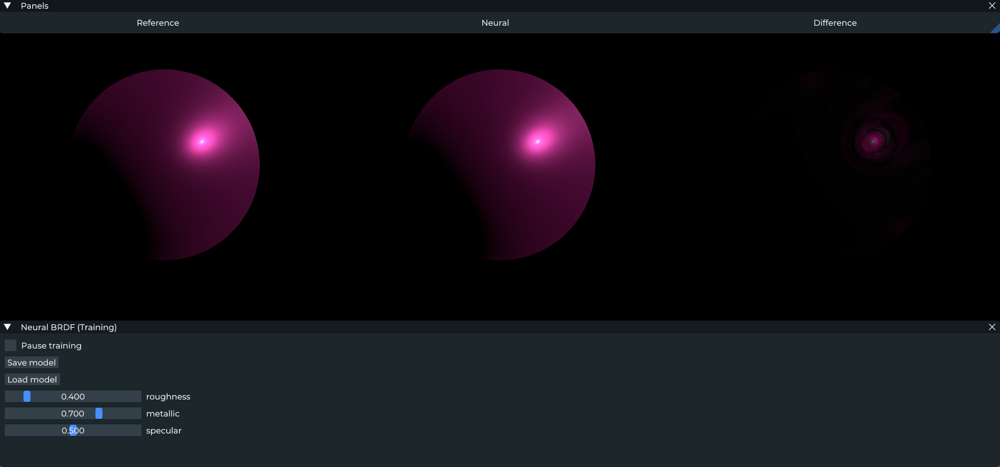
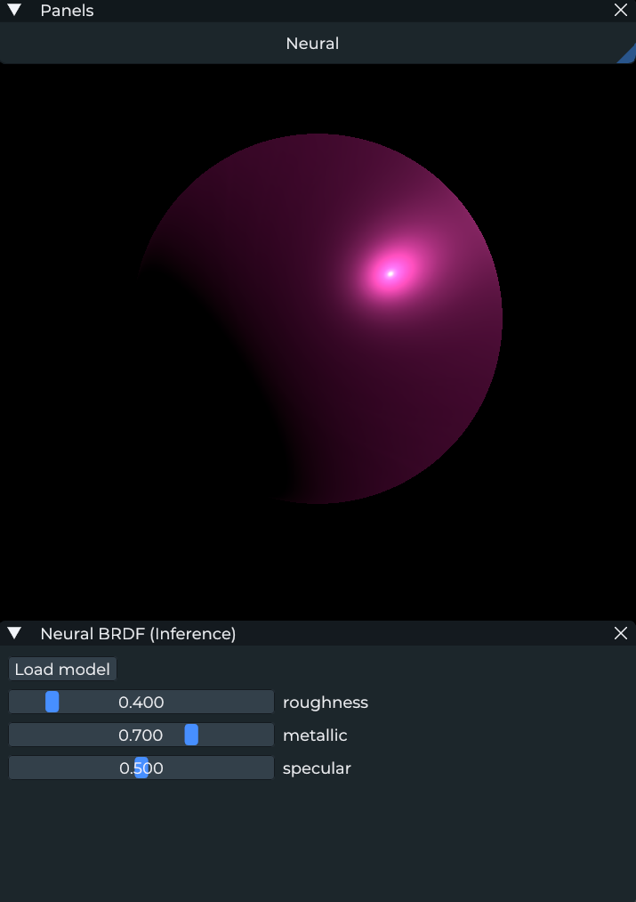

# Neural BRDF

This project approximates a **Disney BRDF** using a small MLP running on the shaders via **Slang and SlangPy** using Cooperative Vectors.  

It is based on **NVIDIA Neural Shading SDK** and adapted to **SlangPy** version.

The repo contains:
- **Training Mode**: It shows **Reference / Neural / Difference** side by side while optimizing the network
- **Inference Mode**: It loads a model and runs Neural BRDF in inference mode

---

### Training (Reference / Neural / Difference)


### Inference (Neural only)


## Video
https://github.com/user-attachments/assets/54320f9c-b785-47c3-952a-9fb2f205688f


---

## How it works

### Network input / output
**Input (5 floats):**  
`[NdotL, NdotV, NdotH, LdotH, roughness]`

**Output (4 floats):**  
`[diffuseTerm, specularTerm, fresnelTerm, clearcoatTerm]`

The model uses:
- Frequency encoding (6 bands)
- 3 hidden layers of 32 Neurons with LeakyReLU
- Exponential Activation at the end

### Training
- Random light direction `L`, view direction `V`, and `roughness` are sampled
- Reference Disney BRDF components are evaluated analytically
- The network is optimized using an **L2Relative loss** with per-component weights
---


## Driver Requirements
If supported, the project uses **Cooperative Vectors** for accelerated neural network execution.

#### DirectX 12
- Using the DirectX Preview Agility SDK requires a shader model 6.9 preview driver:
	- [GeForce](https://developer.nvidia.com/downloads/shadermodel6-9-preview-driver)  
	- [Quadro](https://developer.nvidia.com/downloads/assets/secure/shadermodel6-9-preview-driver-quadro)

#### Vulkan
- Vulkan Cooperative Vector extension requires a release [driver](https://www.nvidia.com/en-gb/geforce/drivers) from R570 onwards

## Fallback Behavior
If Cooperative Vectors are **not supported** on your driver:
- The project will still run, but it will be **significantly slower**

## Software Requirements
- **Python 3.9+**
- [Slang](https://github.com/shader-slang/slang)
- [SlangPy](https://github.com/shader-slang/slangpy)
---

## Running

To Run Training
```bash
python run_train.py 
```
To Run Inference
```bash
python run_inference.py 
```


## Adapted From

- Neural network layers/optimizer interface comes from the SlangPy samples:
  - https://github.com/shader-slang/slangpy-samples/tree/main/experiments/neuralnetwork
- **RTX Neural Shading SDK (RTXNS)**:
  - https://github.com/NVIDIA-RTX/RTXNS

